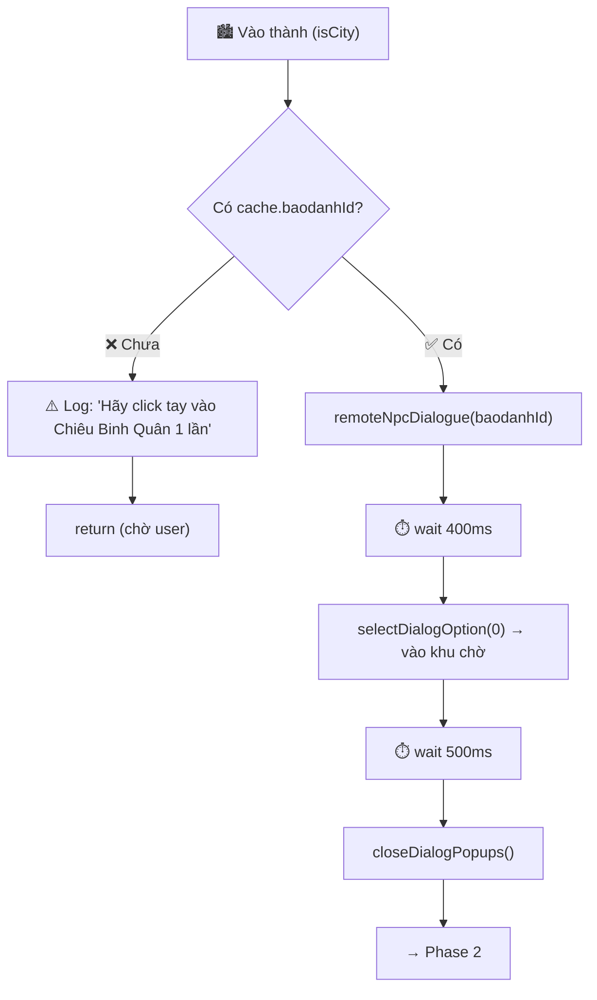
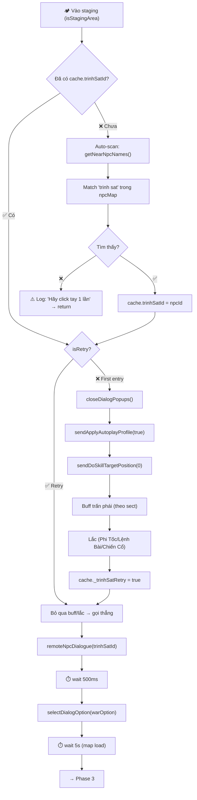
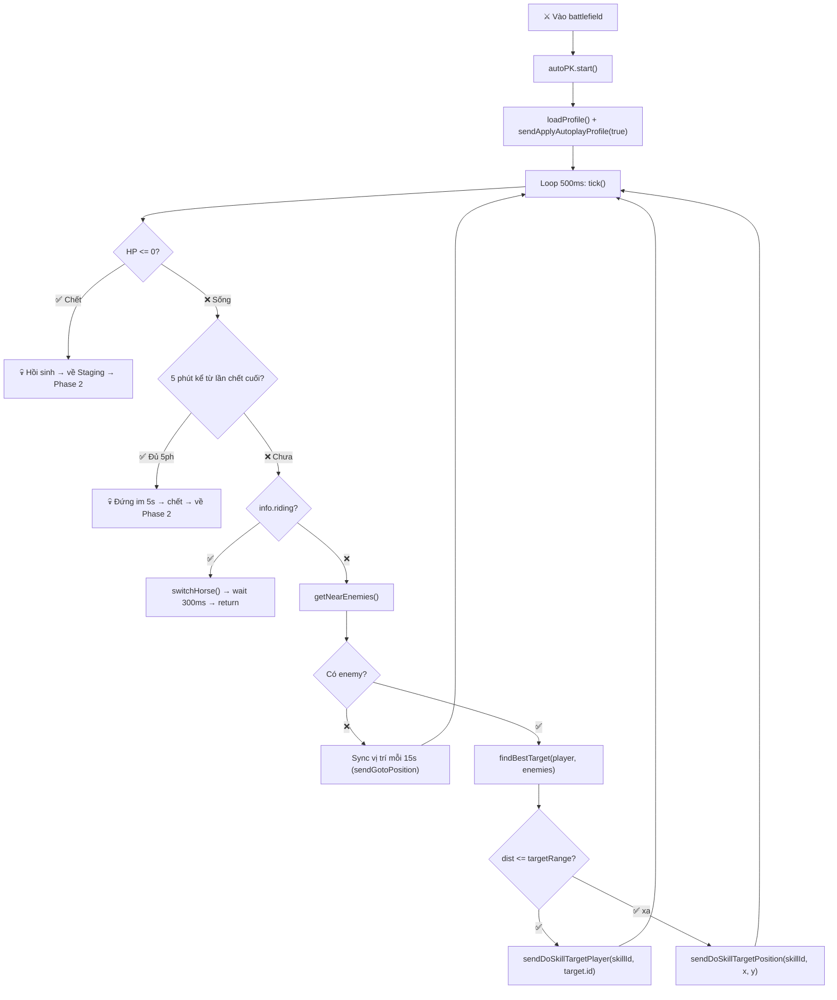

# PLAN: GST Auto PK — Node.js Rewrite

> **Mục tiêu:** Viết lại toàn bộ tool Auto PK VLTK1 bằng Node.js, từng bước một, code đến đâu test đến đó.
> 
> **Ngày bắt đầu:** 2026-06-26
> **Stack:** Node.js v24 + Electron (GUI) + Frida (injection)
> **Game:** VLTK1 Mobile (`vn.perfingame.jx1mobile`)

---

## 🖥️ Môi trường hiện tại

| Thành phần | Trạng thái | Chi tiết |
|-----------|-----------|----------|
| Node.js | ✅ v24.11.0 | Đã cài |
| npm | ✅ 11.6.1 | Đã cài |
| ADB | ✅ | `C:\platform-tools\adb.exe` |
| Devices | ✅ 2 thiết bị | `emulator-5556`, `127.0.0.1:16416` |
| Frida server | ⚠️ Cần kiểm tra | Đã có `frida-server` binary trong project |

---

## 📁 Cấu trúc thư mục mới

```
gst-auto-pk-node/                  ← Project mới (Node.js)
├── package.json
├── PLAN.md                        ← File này
├── config.js                      ← Cấu hình (ADB path, ports, etc.)
│
├── src/
│   ├── index.js                   ← Entry point chính
│   ├── adb.js                     ← STEP 1: ADB wrapper
│   ├── frida-session.js           ← STEP 2: Frida session manager
│   ├── memory-reader.js           ← STEP 3: Đọc memory qua Il2Cpp
│   ├── packet-sniffer.js          ← STEP 4: Bắt gói mạng
│   ├── packet-injector.js         ← STEP 5: Gửi gói mạng
│   ├── auto-pk.js                 ← STEP 6: Logic auto PK
│   └── gui/                       ← STEP 7: Electron GUI
│       ├── main.js
│       ├── preload.js
│       └── renderer/
│           ├── index.html
│           └── app.js
│
├── frida-scripts/                 ← Frida injection scripts (modular!)
│   ├── build.js                   ← Build script: concat modules → bot.bundle.js
│   ├── bot.bundle.js              ← GENERATED: single script to inject
│   ├── test-hello.js              ← Script test Frida đơn giản
│   │
│   ├── core/                      ← Core: state, utilities, opcodes
│   │   ├── globals.js             ← All shared state variables
│   │   ├── helpers.js             ← toHex, parsePacket, il2cppExport
│   │   ├── opcodes.js             ← GS_OPCODES map
│   │   └── il2cpp-init.js         ← Il2Cpp base + PlayerMain reading
│   │
│   ├── hooks/                     ← Socket & Native hooks
│   │   ├── native-funcs.js        ← Find executable write()/read()
│   │   ├── connect.js             ← Hook connect() → detect gameFd
│   │   ├── recv.js                ← Hook recv/read/recvfrom + SSL_read
│   │   └── send.js                ← Hook write/send/sendto/writev/sendmsg + SSL_write
│   │
│   └── rpc/                       ← RPC exports (gọi từ Node.js host)
│       ├── packet-io.js           ← sendPacket, getRecvPackets, lockFd, getDiag
│       ├── player-info.js         ← getMySect, getMySkills, getPlayerInfo
│       ├── movement.js            ← gotoHooked, gotoFindingPath, joystickSet
│       ├── combat.js              ← doSkillHooked, attackPlayerHooked
│       ├── ui-control.js          ← closeDialogPopups, sortBagItems, equipHooked
│       └── diagnostics.js         ← enumActiveUi, captureGoto, listMethods
│
└── ready.js                       ← Ready signal (last in bundle)
│
├── tools/                         ← Tool C (giữ nguyên từ project cũ)
│   ├── injector.exe
│   ├── memfind.exe
│   └── peek.exe
│
├── data/                          ← Dữ liệu
│   └── output/
│       └── npc_db.json
│
└── test/                          ← Unit tests
    ├── test-adb.js
    ├── test-frida.js
    └── test-memory.js
```

---

## 🗺️ Roadmap: 7 Steps

```
STEP 1 ──► STEP 2 ──► STEP 3 ──► STEP 4 ──► STEP 5 ──► STEP 6 ──► STEP 7
 ADB      Frida     Memory    Packet    Packet    Auto PK   Electron
 Connect  Attach    Read      Sniff     Inject    Logic     GUI
```

Mỗi step:
1. Viết code
2. Chạy test ngay
3. ✅ Pass → qua step tiếp theo
4. ❌ Fail → sửa đến khi pass

---

## 📋 Task List Chi Tiết

### STEP 1: ADB Connection Module
- [x] Tạo `package.json` + cài `adbkit` package
- [x] Viết `src/adb.js`: list devices, check game running, start/stop game
- [x] Viết `config.js`: ADB path, package name, device ports
- [x] Test: list devices, check game foreground
- [x] **MILESTONE 1:** ADB hoạt động ✅

### STEP 2: Frida Attach + Hello World
- [x] Cài `frida` npm package
- [x] Viết `frida-scripts/test-hello.js` — script Frida đơn giản
- [x] Viết `src/frida-session.js` — attach, load script, gọi RPC
- [x] Test: attach vào game, in "Hello from Frida"
- [x] **MILESTONE 2:** Frida kết nối thành công ✅

### STEP 3: Memory Read (Bridge-Free Native Offsets)
- [x] Tối ưu hóa: Loại bỏ `frida-il2cpp-bridge` để tránh game bị phát hiện và crash (Safe Mode)
- [x] Viết script đọc trực tiếp địa chỉ ảo (RVA) từ file `data/dump/`
- [x] Định danh hàm `PlayerMain.Update` tại offset `0xE42B54` (prologue) để lấy instance
- [x] Viết `src/memory-reader.js` — Node.js host gọi RPC đọc Name, Level, Map, Money
- [x] Test: đọc thành công thông tin nhân vật từ bộ nhớ
- [x] **MILESTONE 3:** Đọc memory thành công ✅

### STEP 4: Packet Sniff (Socket Hook)
- [x] Port `frida_bot.js` socket hooks → `frida-scripts/hooks/`
- [x] Hook `connect()`, `recv()`, `send()` và `SSL_write`/`SSL_read` từ libc/libssl
- [x] Viết `src/packet-sniffer.js` — nhận packet từ Frida, tự động phục hồi Socket FD (`ePong`)
- [x] Test: bắt được gói mạng game (opcode 70 ePong, opcode 9 StringData...)
- [x] **MILESTONE 4:** Sniff packet thành công ✅

### STEP 5: Packet Inject (Send Packet)
- [x] Gửi packet qua hàm ghi socket native hoặc thông qua gói mã hóa mạng
- [x] Viết `src/packet-injector.js` — gửi packet qua RPC (Varint Protobuf Encoder tự viết)
- [x] Test: gửi gói xả skill, di chuyển qua Packet Injector
- [x] **MILESTONE 5:** Inject packet thành công ✅

### STEP 6: Auto PK Logic
- [x] Đọc danh sách người chơi xung quanh (từ gói opcode 9 StringData)
- [x] Lọc mục tiêu: khác phe, trong tầm đánh
- [x] Gọi kỹ năng qua native function `DoSkill` (offset `0xE4969C`) trực tiếp từ Frida
- [x] Tự động bơm máu/mana theo tỷ lệ cấu hình
- [x] **MILESTONE 6:** Auto PK hoạt động ✅

### STEP 7: Electron GUI
- [x] Setup Electron project + Gold/Dark Gaming interface
- [x] Integrate Device list, connection status logs, and threshold controls
- [x] Implement Nearby Player Stall Shop Scanner (via metadata range)
- [x] Implement Shop Items Detail and Attribute/Option Scanner (via PopUpCanvas)
- [x] **MILESTONE 7:** GUI hoàn chỉnh và Auto PK + Shop Scanner hoạt động ✅

---

## 🔧 Cách chạy test từng step

```bash
# Step 1
node test/test-adb.js

# Step 2
node test/test-frida.js

# Step 3
node test/test-memory.js

# Step 4-6
node test/test-packet.js

# Step 7
npm start
```

---

## 📝 Ghi chú

- **Frida server** cần chạy trên thiết bị Android trước khi attach
- **Game package:** `vn.perfingame.jx1mobile`
- **Il2Cpp dump:** `Il2CppDumper-net6-v6.7.46/dump.cs` — tham khảo cấu trúc class
- **ADB path:** `C:\platform-tools\adb.exe`
- **Ports phổ biến:** MuMu (5555, 266xx), MEmu (215x3)

---

## 🔄 Tống Kim Auto Workflow (2026-07-04)

Toàn bộ flow chạy trong `src/gui/main.js` loop **2.5s**, chia 3 phase theo mapId.

```
Phase 1 (Thành) → Phase 2 (Staging) → Phase 3 (Chiến Trường)
                        ↑                      │
                        └────── (chết) ─────────┘
```

### Phase 1: Thành → Báo Danh (`tongkim.js`)



### Phase 2: Staging → Buff + Lắc + Gọi Trinh Sát (`tongkim.js`, loop 2.5s)



- **warOption**: Tống=0, Kim=1 (dựa trên campValue)
- **Sect→Buff map**: `{0:102, 1:111, 2:129, 3:139, 4:159, 5:109, 6:179, 7:189, 8:209, 9:219}`
- **_trinhSatRetry reset**: khi `lastMapId !== mapId` (về staging từ map khác)

### Phase 3: Chiến Trường → Auto PK (`auto-pk.js`, loop 500ms)



**findBestTarget logic:**
- `usePriorityRange=true` (mặc định): Phạm vi ưu tiên → ưu tiên khắc hệ ngũ hành; mở rộng → gần nhất
- `usePriorityRange=false`: Toàn bộ → gần nhất thuần
- `ignoreInvulnerable=true`: Bỏ qua mục tiêu có state 2 (bất khả xâm phạm) hoặc 52

**Ngũ hành:** 0=Kim, 1=Mộc, 2=Thủy, 3=Hỏa, 4=Thổ  
**Khắc:** Kim→Mộc, Mộc→Thổ, Thổ→Thủy, Thủy→Hỏa, Hỏa→Kim

**5ph tự chết:** Mỗi 5 phút autoPK đứng im 5s → nhân vật bị địch giết → HP=0 → hồi sinh về Staging → loop 2.5s phát hiện staging → Phase 2 chạy lại.

### NPC Auto-Detect (`frida-scripts/rpc/npc/NPCScanner.js`)

Không cần bridge Il2Cpp. Scanner quét **toàn bộ vùng nhớ rw-** tìm NpcController instances:

1. `__findNpcControllerClass()`: Quét `global-metadata.dat` string table → tìm "NpcController" → lấy Il2CppClass pointer
2. `getNearNpcNames()`: Duyệt heap rw- → object có klass==NpcController → đọc `cid@+0x28` + `npcName@+0x30`
3. Trả về `npcMap: { "113": "Tống Trinh Sát", "101": "Tống Quân Nhu", ... }`

### File Map

| File | Vai trò |
|------|---------|
| `src/gui/main.js` | Loop chính 2.5s, route theo mapId → Phase 1/2/3 |
| `src/features/tongkim.js` | Phase 1 (báo danh) + Phase 2 (buff, gọi Trinh Sát, hồi sinh) |
| `src/auto-pk.js` | Phase 3: autoPK 500ms tick, findBestTarget, cast skill, 5ph tự chết |
| `src/packet-injector.js` | Gửi packet (skill, move, autoplay profile) |
| `frida-scripts/rpc/npc/NPCScanner.js` | Auto-detect NPC không cần bridge |
| `frida-scripts/rpc/ui-control.js` | isDialogOpen, closeDialogPopups, selectDialogOption |
| `frida-scripts/rpc/core/DialogManager.js` | remoteNpcDialogue, selectDialogOption (gửi op35) |
